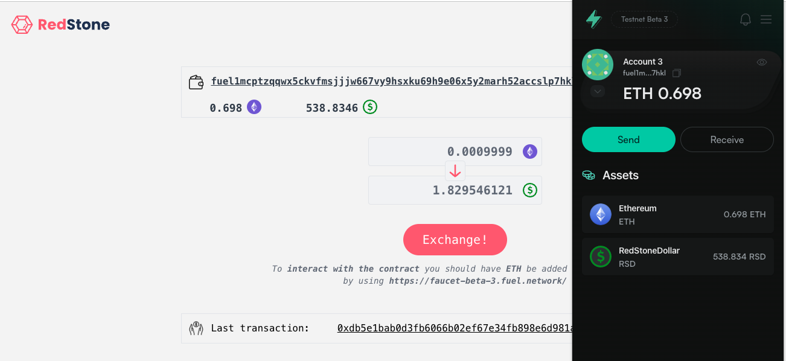

# RedStone Fuel DEX

## Introduction

The project is a simple DEX based on RedStone Oracles data. 
The user can exchange ETHs from their own wallet for the asset defined by the seller.
The asset is saved to the user's wallet.

It's very easy to redeploy the contracts and use with an own asset, as a template by doing small changes.
The big advantage of the project is **simplicity**.

The security is guaranteed by RedStone Core Model with on-chain data verification and value aggregation
https://docs.redstone.finance/docs/introduction

## The DEX architecture

* The wallet is connected by a fuel-wallet extension
* The user enter the amount of ETHs they want to exchange to the asset. 
* The price of the asset is fetched by using RedStone SDK as a RedStone payload data.
* The interface shows the amount of assets to be exchanged to
* After picking the *Exchange!*-button, the transaction starts and must be approved
* The RedStone payload data and the amount of assets to be bought is sent by the RedStone Fuel Connector to the contract
* The contract (by using RedStone Fuel SDK) decrypts the payload, checks timestamps of data, validates the signature to check the passed RedStone data authenticity 
* The transaction continues on-chain: the amount of assets is exchanged by using the ETHs paid
* The interface updates and number of assets is visible in the fuel-wallet extension
* The contract owner can withdraw from the contract the ETHs paid by other users.

## Sample

[See the sample movie on YouTube](https://youtu.be/ZtRhINKhykk)